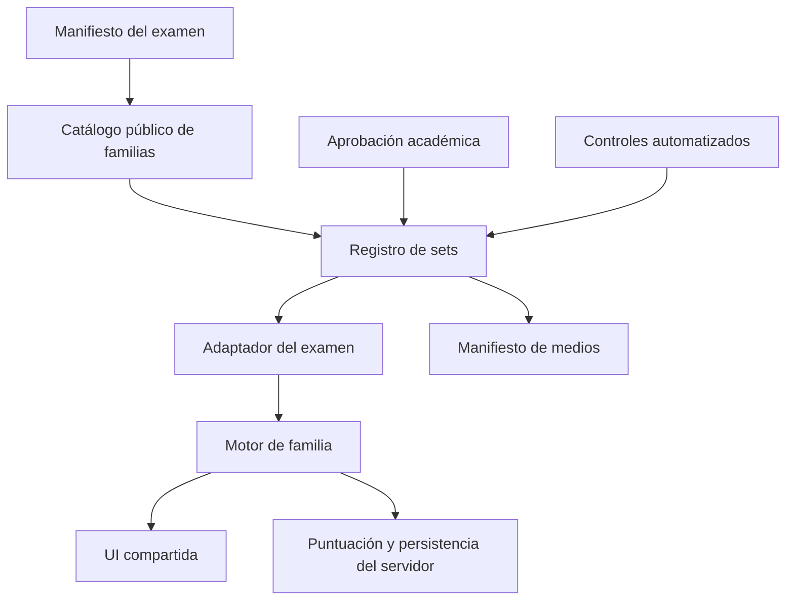

# Blueprint de expansión de prácticas de examen

**Estado:** contrato operativo v1

**Fecha:** 7 de septiembre de 2026

**Referencia implementada:** TOEFL Practice 2026

**Plantilla visual:** [PRACTICE-UI-TEMPLATE.md](./PRACTICE-UI-TEMPLATE.md)

**Contratos especializados TOEFL:**
[TOEFL-PRACTICE-FAMILY-BLUEPRINTS.md](./TOEFL-PRACTICE-FAMILY-BLUEPRINTS.md)

Este blueprint convierte la unificación visual de TOEFL en un sistema reutilizable. La
unidad de expansión es la **familia de ejercicio**: un comportamiento académico e
interactivo estable que puede recibir nuevos sets, formar parte de otro examen o usar
otro idioma sin duplicar su interfaz.

## 1. Resultado esperado

La arquitectura debe permitir que:

- un set nuevo use un motor existente y agregue principalmente datos;
- una familia nueva declare su contrato antes de crear su motor;
- un examen nuevo componga familias mediante un registro liviano;
- el idioma de la interfaz y el idioma del contenido se configuren por separado;
- claves, rúbricas privadas y lógica sensible de puntuación permanezcan en el servidor;
- cada versión publicada conserve trazabilidad académica, multimedia y técnica;
- las rutas públicas continúen siendo estables aunque cambie la implementación interna.

## 2. Modelo conceptual

```text
Producto de examen
└── Sección
    └── Familia de ejercicio
        └── Set
            ├── Estímulos
            ├── Ítems
            └── Medios
```

- **Producto:** TOEFL, IELTS, Cambridge B2 u otro examen.
- **Sección:** Reading, Listening, Writing, Speaking u otra división pública.
- **Familia:** interacción repetible, por ejemplo completar palabras, selección única,
  construir una oración o grabar una respuesta.
- **Set:** paquete versionado de contenido que usa una o varias familias.
- **Motor:** componente que interpreta el contrato de una familia y administra su estado.

El nombre académico de una actividad no crea por sí solo un motor nuevo. Dos familias
pueden compartir motor cuando tienen la misma entrada, respuesta y transición de estado.

## 3. Arquitectura de referencia



| Capa | Responsabilidad | No debe contener |
|---|---|---|
| Manifiesto del examen | Identidad, secciones, rutas, idiomas y políticas | Contenido completo de los ítems |
| Catálogo público | Familias visibles, orden, descripciones y disponibilidad | Claves de respuesta privadas |
| Registro de sets | IDs, versiones, orden y referencias a contenido | Decisiones de presentación |
| Adaptador | Traduce datos del examen al contrato del motor | Copias completas del motor |
| Motor de familia | Interacción, validación visible y estados | Supuestos exclusivos de un examen |
| UI compartida | Estructura, navegación, accesibilidad y ritmo visual | Reglas académicas particulares |
| Servidor | Claves, scoring, rúbricas, entregas y datos sensibles | Dependencia de estado visual del navegador |

## 4. Contrato de producto y familia

Los nombres son orientativos. El contrato real puede ser TypeScript, JSON validado o una
combinación de ambos, pero debe expresar estas decisiones de forma explícita.

```ts
type PracticeSection = "reading" | "listening" | "writing" | "speaking" | string;

type PracticePolicy = {
  mode: "practice" | "simulation";
  navigation: "free" | "sequential";
  responseRequiredToContinue: boolean;
  audioReplay: "unlimited" | "limited" | "not-applicable";
  timer: "none" | "informational" | "enforced";
  scoring: "local" | "server" | "human" | "hybrid" | "self-review";
  persistence: "browser" | "account" | "submission";
};

type PracticeFamilyDefinition = {
  familyId: string;
  sectionId: PracticeSection;
  engineId: string;
  route: string;
  titleKey: string;
  descriptionKey: string;
  accent: string;
  setRegistryId: string;
  policy: PracticePolicy;
  interfaceLocale: string;
  contentLocale: string;
  sourceClaimIds: string[];
};

type PracticeProductDefinition = {
  productId: string;
  version: string;
  baseRoute: string;
  interfaceLocales: string[];
  contentLocales: string[];
  sections: Array<{ sectionId: PracticeSection; familyIds: string[] }>;
};
```

### Política base de práctica

Toda ruta declarada como `practice` debe permitir:

- navegación hacia delante y hacia atrás;
- continuar sin responder;
- reproducir, pausar y repetir cada audio sin límite;
- volver a escuchar después de responder o cambiar de ítem;
- persistencia local cuando el motor pueda restaurar el estado con seguridad;
- feedback acorde con el tipo de corrección, sin presentar una estimación como puntaje
  oficial.

Las restricciones de un simulacro solo se aplican en un modo y una ruta claramente
identificados como `simulation`.

## 5. Contrato mínimo de un set

```ts
type PracticeSetManifest = {
  setId: string;
  productId: string;
  familyIds: string[];
  setNumber: number;
  contentVersion: string;
  status: "draft" | "approved" | "release-candidate" | "published";
  interfaceLocale: string;
  contentLocale: string;
  itemIds: string[];
  scoringObjectIds: string[];
  mediaManifestId?: string;
  sourceClaimIds: string[];
  approvalRecordId?: string;
};
```

Invariantes:

1. `setId` e `itemIds` son estables y únicos dentro del producto.
2. Una modificación académica cambia `contentVersion`.
3. El orden público se declara en un registro; no depende del orden de importación.
4. Solo `approved`, `release-candidate` o `published` puede aparecer en el catálogo
   público según la política del entorno.
5. Una edición posterior a la aprobación invalida su hash y exige nueva revisión.
6. Las claves de respuesta y rúbricas privadas se referencian por ID y no viajan al
   navegador antes de ser necesarias.

## 6. Contrato de medios

```ts
type PracticeMediaEntry = {
  mediaId: string;
  kind: "audio" | "image" | "video";
  publicUrl: string;
  status: "missing" | "generated" | "reviewed" | "published";
  scriptHash?: string;
  fileHash: string;
  durationSeconds?: number;
  locale?: string;
  voices?: string[];
  reviewedBy?: string;
  reviewedAt?: string;
};
```

Reglas:

- La duración se obtiene del archivo final, no de una estimación del guion.
- Regenerar un audio crea un hash nuevo y vuelve a abrir la revisión auditiva.
- El texto visible, el guion aprobado y el audio deben conservar paridad.
- Un control sin archivo reproducible muestra un estado de medio faltante; no simula un
  reproductor activo.
- Si la reproducción está permitida, el cursor y los estados visuales también deben
  comunicar que el control está habilitado.
- En práctica, `audioReplay` es siempre `unlimited`.

## 7. Biblioteca de motores

| Motor base | Entrada | Respuesta | Familias típicas |
|---|---|---|---|
| `single-select` | estímulo + opciones | una opción | preguntas de lectura o escucha |
| `multi-select` | estímulo + opciones | varias opciones | selección múltiple |
| `text-completion` | texto con huecos | texto o selección por hueco | completar palabras |
| `sequence-builder` | piezas ordenables | secuencia | construir oraciones |
| `reading-choice` | pasaje + ítems | selección por ítem | lectura diaria o académica |
| `listening-choice` | audio + ítems | selección por ítem | conversaciones o anuncios |
| `timed-writing` | consigna + contexto | texto largo | email o discusión |
| `speaking-recorder` | audio/texto + preparación | grabación | repetición o entrevista |
| `matching` | dos colecciones | pares | clasificación o relación |
| `self-review` | consigna + criterios | producción abierta | práctica sin scoring automático |

Se crea un motor nuevo cuando cambia la forma de entrada, la forma de respuesta o el
ciclo de estado. Una variación de tema, dificultad o nombre académico se resuelve en los
datos o en un adaptador.

## 8. Composición visual obligatoria

Cada ruta de familia compone, en este orden:

1. `PracticeRouteShell`: contexto, breadcrumbs, ancho y salida.
2. `PracticeSetCatalog`: listado previo cuando existen varios sets.
3. `PracticeSessionHeader`: título, instrucción y métrica de la sesión elegida.
4. Motor de la familia: contenido e interacción propios.

Son invariantes la geometría general, jerarquía, navegación, estados de foco, tamaños
táctiles y comportamiento móvil. Pueden variar el color de sección, iconos, textos,
métrica visible y controles propios del motor.

## 9. Rutas y navegación

Flujo público:

```text
Hub del examen → sección/familia → catálogo de sets → sesión seleccionada
```

Para productos nuevos se recomienda:

```text
/practica/{exam}/ejercicios
/practica/{exam}/{section}/{family}
/practica/{exam}/{section}/{family}/{setId}
```

Las rutas históricas pueden conservar query params o segmentos anteriores mediante un
adaptador. Un `setId` inexistente debe producir 404 o una explicación visible; nunca debe
abrir silenciosamente el Set 1.

## 10. Idioma de interfaz y de contenido

Estos valores son independientes:

| Producto | Interfaz | Contenido |
|---|---|---|
| TOEFL en inglés | `en` | `en` |
| Preparación TOEFL guiada en español | `es` | `en` |
| Examen de francés | `es` o `fr` | `fr` |

Cuando se incorpore el primer producto con otra interfaz, los textos compartidos pasan a
diccionarios por clave. Un control automático debe detectar texto accidental en un idioma
distinto del declarado, con una lista explícita de excepciones pedagógicas.

## 11. Puntuación, privacidad y persistencia

- Las claves privadas viven en un registro de servidor versionado por objeto de scoring.
- Cada familia declara si la corrección es automática, humana, híbrida o de autoevaluación.
- Una producción abierta no recibe un puntaje oficial falso. Puede mostrar criterios,
  cobertura, longitud y feedback claramente etiquetado.
- Las grabaciones son privadas por defecto y declaran retención, propietario y mecanismo
  de eliminación antes de activar almacenamiento remoto.
- El alcance de persistencia se comunica: navegador, cuenta o entrega formal.

## 12. Flujo editorial y académico

```text
DRAFT
  → AUTOMATED_CHECKED
  → ACADEMIC_REVIEW
  → APPROVED
  → MEDIA_VERIFIED
  → RELEASE_CANDIDATE
  → PUBLISHED
```

La aprobación registra:

- alcance exacto: producto, familias, sets e ítems;
- hash o versión revisada;
- revisor y fecha;
- observaciones y excepciones;
- evidencia adicional cuando hay audio.

Los controles automatizados deben cubrir como mínimo IDs duplicados, referencias rotas,
claves ausentes, cantidad de opciones, distribución de respuestas, distractores repetidos,
mezcla accidental de idiomas, sesgo de longitud de opciones y paridad entre guion, archivo
y duración. Estos controles preparan la revisión; no sustituyen la aprobación académica.

## 13. Puertas de calidad

### Datos

- Manifiestos válidos, IDs únicos y versiones coherentes.
- Conteos esperados por familia y set.
- Referencias de scoring y medios existentes.
- Ninguna clave privada incluida en el bundle del cliente.

### Contenido

- Fuente y claims documentados.
- Revisión de claridad, respuesta inequívoca y distractores plausibles.
- Distribución de respuestas y sesgo de longitud revisados.
- Idioma, nivel y tono acordes con el contrato.

### Medios

- Todos los archivos resuelven con estado correcto.
- Duración, hash y guion coinciden con el manifiesto.
- Revisión auditiva registrada.
- Reproducción ilimitada y sin bloqueo visual en práctica.

### Experiencia

- Catálogo antes de la sesión cuando hay múltiples ejercicios.
- Navegación libre y continuación sin respuesta en práctica.
- Estado restaurado tras recargar cuando corresponde.
- Uso completo por teclado, foco visible, labels y contraste suficiente.
- Verificación en móvil y escritorio sin desplazamiento horizontal.

### Ingeniería y publicación

- TypeScript y lint relevantes pasan.
- Guardianes de producto y pruebas de comportamiento pasan.
- `prebuild` y `build` pasan en el commit candidato.
- El commit candidato integra el `main` remoto vigente.
- Vercel termina en éxito y los smoke tests de rutas críticas pasan.

## 14. Recetas de expansión

### Agregar un set a una familia existente

1. Crear el manifiesto y los IDs de contenido.
2. Reutilizar el motor y adaptador actuales.
3. Registrar medios y scoring sin exponer claves.
4. Ejecutar controles de datos y contenido.
5. Obtener aprobación académica sobre la versión exacta.
6. Agregar el set al registro público.
7. Verificar catálogo, sesión, navegación, persistencia y audio.

### Agregar una familia a un examen existente

1. Definir entrada, respuesta, scoring y política de práctica.
2. Mapearla a un motor existente; justificar por escrito uno nuevo si hace falta.
3. Crear un set vertical completo.
4. Registrar la familia en sección y catálogo.
5. Aplicar la composición visual compartida.
6. Pasar todas las puertas antes de producir más sets.

### Agregar un examen nuevo

1. Crear el manifiesto del producto y sus secciones.
2. Elegir una familia representativa y producir tres sets completos.
3. Validar el flujo desde hub hasta resultado o entrega.
4. Crear guardianes específicos a partir del contrato común.
5. Ampliar familias y volumen cuando esa sección vertical esté aprobada.

### Agregar otro idioma

1. Declarar por separado `interfaceLocale` y `contentLocale`.
2. Añadir diccionario de interfaz y reglas de excepciones lingüísticas.
3. Versionar contenido y medios por locale.
4. Hacer revisión académica con competencia en el idioma objetivo.
5. Probar expansión de texto, pronunciación, teclado y accesibilidad.

## 15. Estructura de carpetas recomendada

```text
src/
  components/
    exam-practice/              # shell, catálogo y encabezado compartidos
    practice-engines/           # motores reutilizables
  data/
    practica/
      exam-practice-registry.ts # productos y familias públicos
      {exam}/
        catalog.ts
        sets/
        media/
  server/
    practice-scoring/           # claves, rúbricas y scoring privado
app/
  practica/{exam}/...
scripts/
  check-practice-*.mjs
docs/
  approvals/
  release-evidence/
```

La migración a esta estructura se hace cuando exista el primer producto adicional que la
necesite. No se mueve código TOEFL estable solo para imitar el diagrama.

## 16. Mapa actual de TOEFL

Los contratos de entrada, respuesta, navegación, audio, feedback, persistencia y
validación de cada fila se detallan en
[TOEFL-PRACTICE-FAMILY-BLUEPRINTS.md](./TOEFL-PRACTICE-FAMILY-BLUEPRINTS.md).

| Sección | Familia pública | Motor base | Cobertura actual |
|---|---|---|---|
| Reading | Complete the Words | `text-completion` | 20 sets |
| Reading | Read in Daily Life | `reading-choice` | 20 sets |
| Reading | Read an Academic Passage | `reading-choice` | 20 sets |
| Listening | Listen and Choose a Response | `listening-choice` | 20 grupos |
| Listening | Listen to a Conversation | `listening-choice` | 20 grupos |
| Listening | Listen to an Announcement | `listening-choice` | 20 grupos |
| Listening | Listen to an Academic Talk | `listening-choice` | 20 grupos |
| Writing | Build a Sentence | `sequence-builder` | 20 sets |
| Writing | Write an Email | `timed-writing` | 20 sets |
| Writing | Academic Discussion | `timed-writing` | 20 sets |
| Speaking | Listen and Repeat | `speaking-recorder` | 20 grupos |
| Speaking | Take an Interview | `speaking-recorder` | 20 grupos |

Este mapa es la línea base para comprobar que una abstracción nueva representa casos
reales y no elimina capacidades ya publicadas.

## 17. Fases de implementación

### A. Contrato

Definir manifiestos, políticas, IDs, validadores y propiedad académica. No producir volumen
hasta cerrar este contrato.

### B. Corte vertical

Implementar una familia con tres sets, medios, scoring, persistencia, UI y evidencia de
publicación. Corregir el contrato con lo aprendido.

### C. Escala

Agregar sets por datos, activar familias adicionales y medir duplicación. Extraer un motor
solo cuando dos implementaciones demuestren el mismo comportamiento.

### D. Publicación

Congelar versión académica, ejecutar puertas, integrar el último `main`, desplegar y
registrar commit, deployment y smoke tests.

## 18. Definición de terminado

Una expansión está terminada cuando:

- manifiesto y catálogo son la fuente de verdad;
- cada familia está asociada a un motor y una política explícitos;
- la aprobación académica corresponde a los hashes actuales;
- medios, claves y versiones tienen paridad;
- las rutas de práctica permiten navegación libre y audio ilimitado;
- interfaz, accesibilidad y móvil cumplen la plantilla común;
- guardianes, pruebas relevantes, `prebuild` y `build` pasan;
- el SHA publicado existe en `origin/main`;
- el deployment y los smoke tests están registrados.

Para ejecutar este proceso en una expansión concreta, copiar y completar
[EXAM-PRACTICE-EXPANSION-CHECKLIST.md](./templates/EXAM-PRACTICE-EXPANSION-CHECKLIST.md).
