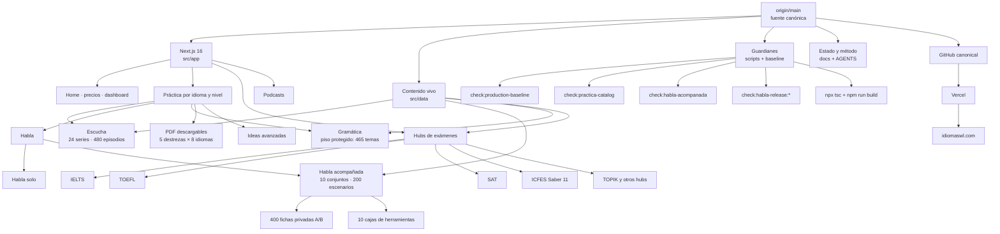

# Mapa de conocimiento de `main`

Snapshot trazable del repositorio canónico, levantado el **26 de agosto de 2026** desde
`origin/main@68ad57e414462b29b76d9504179f42338940f369`. Describe qué está versionado en `main`;
no afirma que un deployment anterior ya sirva cada commit.

## Inventario operativo

| Área | Fuente viva | Guardia principal | Estado en este snapshot |
|---|---|---|---|
| Gramática y catálogo de práctica | `src/data/grammar/`, `src/data/practica/` | `check:practica-catalog` | Piso de 465 temas protegido |
| Escucha | `src/data/practica/series/`, `public/audio/` | `check:listening-series` + catálogo | 24 series, 480 mp3 |
| Habla acompañada | `src/data/practica/habla-acompanado/` | `check:habla-acompanada` + release por set | 10/24 conjuntos, 200/480 escenarios |
| PDF descargables | `src/lib/pdf/`, componentes de práctica | baseline + `check:pdf-fonts` | 5 destrezas en 8 idiomas |
| Ideas avanzadas | `src/data/practica/advanced-topics.ts` | `check:advanced-ideas` | Hub y lecciones dinámicas protegidas |
| IELTS | rutas y datos IELTS | guardianes `check:ielts-*` | Hub, Task 1/2 y revisión protegidos |
| TOEFL | rutas y datos TOEFL | guardianes `check:toefl-*` | Hub, audio, editorial y pagos protegidos |
| SAT | rutas y datos SAT | `check:sat*` + factory tests | Superhub y flujo adaptativo protegidos |
| ICFES | rutas y datos ICFES | baseline + auditorías ICFES | Juego adaptativo y banco inteligente protegidos |
| Navegación/SEO | `src/app`, sitemap y componentes compartidos | baseline, navegación, SEO | Rutas críticas y marcadores protegidos |

## Cómo leer este mapa

- **Versionado en `main`** significa que existe en el commit indicado.
- **Desplegado** solo se declara después de comprobar que Vercel construyó ese mismo SHA y que el
  smoke de producción pasó.
- Un archivo en `artifacts/`, `outputs/`, otro repositorio o una rama `archive/*` no forma parte de
  este mapa aunque conserve información útil.
- Antes de actualizar el mapa, ejecutar los guardianes; no cambiar cifras a mano para reflejar una
  intención futura.

Documentos relacionados:

- [`OPERACION-REPOSITORIO.md`](OPERACION-REPOSITORIO.md)
- [`PLAN-COMUNICACION-RAMAS-Y-PRODUCCION.md`](PLAN-COMUNICACION-RAMAS-Y-PRODUCCION.md)
- [`METODOLOGIA-HABLA-ACOMPANADA.md`](METODOLOGIA-HABLA-ACOMPANADA.md)
- [`escucha-estado.md`](escucha-estado.md)
- [`sat-estado.md`](sat-estado.md)
- [`pdf-descargables-estado.md`](pdf-descargables-estado.md)
