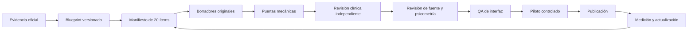

# Flujo de trabajo antes de iniciar el loop de contenido

Estado: fase 0 implementada en código; el loop clínico aún no está autorizado.

## 1. Principio operativo

No se empieza por “escribir muchas preguntas”. Se empieza por demostrar qué examen se está modelando, qué fuente clínica resolverá cada ítem y quién responde por su revisión.



El loop real es `C → K`. Las fases `A` y `B` son prerrequisitos y vuelven a ejecutarse cuando una universidad publica una convocatoria nueva.

## 2. Fase 0 — arquitectura y evidencia

### Entrada

- documento alojado en dominio oficial de la universidad;
- ciclo o fecha de vigencia identificable;
- afirmaciones verificables sobre formato, dominio, duración, calificación o etapas;
- lista explícita de lo que la universidad no publica.

### Salida obligatoria

- fuente registrada en `official-sources.ts`;
- perfil versionado en `university-blueprints.ts`;
- toda ausencia representada como `null` + `not-published`;
- guardián y pruebas en verde;
- aviso de preparación independiente;
- decisión binaria sobre cada capacidad: práctica, cronómetro, especialidad, inglés, CV/entrevista y simulacro completo.

### Regla de capacidad

Un perfil solo habilita simulacro completo cuando hay evidencia oficial de:

1. cantidad total;
2. duración;
3. composición del examen.

Hoy cumplen esta puerta Universidad de Caldas 2027 y Universidad de Cartagena 2027-1. UdeA, Univalle, UNAL, Libre, Uninorte y Universidad del Atlántico no pueden recibir esa etiqueta todavía.

## 3. Selección de un lote

Cada lote contiene 20 ítems. Es suficientemente pequeño para revisar a fondo y suficientemente grande para medir patrones de clave, longitud y cobertura.

El manifiesto del lote debe declarar antes de redactar:

- blueprint y versión;
- dominio oficial y nodo editorial;
- especialidad, sistema, tema y subtema;
- tarea cognitiva;
- población y escenario de atención;
- dificultad editorial esperada;
- fuente clínica primaria prevista;
- responsable de autoría y revisor clínico;
- distribución planeada de claves.

No se agrega una pregunta y luego se busca dónde encajarla.

## 4. Redacción y uso de IA

La IA puede:

- proponer estructuras de caso y distractores;
- detectar ambigüedades, pistas de longitud o claves repetidas;
- normalizar el formato y preparar tablas de cobertura;
- comparar el borrador contra fuentes proporcionadas.
- realizar una preauditoría adversarial versionada y producir un expediente de hallazgos.

La IA no puede:

- inventar una recomendación clínica;
- elegir por sí sola cuál guía prevalece;
- aprobar un ítem;
- usar preguntas recordadas, filtradas o compradas;
- publicar directamente en el banco.
- firmar como médico o convertir consenso automatizado en aprobación clínica.

Todo texto generado pasa por revisión humana. El autor no puede ser el único aprobador. El
consejo descrito en `AGENTES-VERIFICACION.md` termina, como máximo, en
`blocked-human-clinical-signoff` mientras falten médicos acreditados.

## 5. Puertas por pregunta

### G0 — estructura

- ID y revisión únicos;
- una sola respuesta correcta;
- número de opciones con IDs estables y coherente con el blueprint; Universidad Libre 2025 usa tres;
- explicación de la correcta y de cada distractor;
- objetivo, perla clínica y taxonomía completa;
- al menos una fuente con año y localizador.

### G1 — originalidad y seguridad

- sin ocho palabras consecutivas coincidentes con otros ítems del banco, salvo términos inevitables;
- declaración de originalidad;
- sin datos reales de pacientes;
- imagen con licencia, atribución y texto alternativo;
- sin logos o formulaciones que sugieran aval universitario.

### G2 — revisión clínica

- recomendación compatible con la fuente vigente;
- escenario clínico verosímil y datos suficientes;
- no hay dos respuestas defendibles;
- dosis, unidades, edades y puntos de corte verificados;
- limitaciones o controversias documentadas.

El revisor clínico debe ser médico con identidad registrada. No puede aprobar su propio ítem.

### G3 — fuente

- prioridad Colombia cuando exista guía o norma vigente;
- URL/DOI y sección exacta disponibles;
- fecha de revisión y próxima revisión;
- si dos fuentes difieren, el ítem se suspende hasta resolver el contexto.

### G4 — psicometría editorial

- no hay pistas por longitud, absolutismos o gramática;
- distractores representan errores clínicos plausibles;
- balance de claves del lote;
- tarea cognitiva coherente con el objetivo;
- dificultad inicial justificada.

### G5 — producto y accesibilidad

- stem, tabla, imagen y opciones funcionan en móvil;
- teclado y lector de pantalla completan el flujo;
- temporizador no impide guardar o reanudar;
- correcto/error no depende solo del color;
- fuente y explicación no quedan ocultas por el plan comercial.

## 6. Estados editoriales

```text
draft
→ clinical-review
→ source-review
→ psychometric-review
→ ui-qa
→ pilot
→ published
→ suspended | retired
```

No se salta un estado. Cada transición conserva actor, fecha y motivo. `suspended` retira el ítem de sesiones nuevas y de colas de repaso; `retired` mantiene el historial analítico sin volver a servirlo.

## 7. Piloto y publicación

Un lote aprobado editorialmente entra primero a piloto. No afecta predictores ni rankings.

Mínimos antes de publicación estable:

- muestra suficiente declarada; no hay un número mágico universal;
- tiempo mediano razonable;
- cada distractor atrae respuestas o queda justificada su permanencia;
- dificultad y discriminación no muestran anomalías graves;
- comentarios clínicos resueltos;
- cero errores críticos de guardado, respuesta o exposición de clave.

Las métricas observadas no sustituyen la revisión médica. Un ítem popular puede seguir siendo incorrecto.

## 8. Cadencia de actualización

- convocatoria universitaria: verificar al abrir cada ciclo y 30 días antes de la prueba;
- normas colombianas: revisión trimestral automatizada + revisión humana al detectar cambio;
- guías clínicas de alta volatilidad: cada 6 meses;
- guías clínicas estables: cada 12 meses;
- ciencias básicas estables: cada 24 meses;
- ítem reportado como riesgoso: suspensión inmediata hasta revisión.

## 9. Primer vertical slice recomendado

Universidad de Caldas 2027, Medicina Interna:

1. 40 ítems originales de medicina general compartibles con otros blueprints;
2. 20 ítems específicos de Medicina Interna;
3. modo estudio y modo examen de 120 minutos;
4. reporte por dominio, tiempo y confianza;
5. fuentes visibles;
6. piloto cerrado, sin predictor de admisión.

Este slice prueba el viaje completo con el blueprint público más preciso. Luego el núcleo general puede alimentar Cartagena, UdeA y Univalle sin duplicar preguntas; lo que cambia es el ensamblaje y el aviso de evidencia.

## 10. Autorización para iniciar el loop

El primer lote no comienza hasta tener:

- blueprint elegido y guardián en verde;
- médico responsable y revisor independiente;
- política de fuentes aceptada;
- formato de manifiesto y acta de revisión;
- prototipo de pregunta y reporte probado en móvil;
- presupuesto por ítem revisado;
- criterio de suspensión clínica y canal de reporte.

La fase actual cumple la arquitectura de datos y evidencia. Aún faltan responsables clínicos, presupuesto editorial y prototipo UX antes de producir contenido en serie.

### Preparación ya disponible

Los roles y prompts automatizados, el controlador determinista, los contratos de atestación y
24 casos adversariales ya están definidos sin instalar un runtime remoto. Cuando el usuario
diga «vamos» se ejecutará primero `PROTOCOLO-VAMOS.md`: gobernanza y evals sintéticos, luego UX
sintética y solo después un lote de cinco borradores retenidos. Esto no elimina las dos firmas
médicas humanas exigidas para llegar a piloto.
