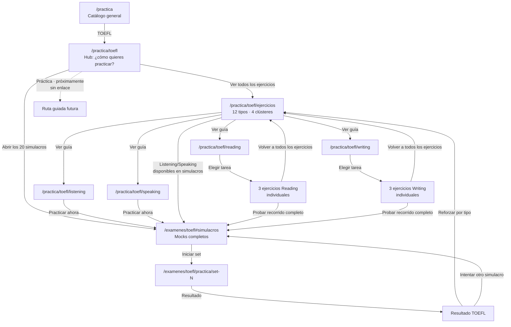

# HR-03 — Primer boceto de interconexión TOEFL

**Estado:** revisión humana solicitada

**Base aprobada:** HR-01A + HR-02 v2

**Objetivo:** conectar el hub, el catálogo, las guías por sección, los ejercicios y los simulacros sin crear callejones sin salida, páginas falsas ni dos URLs compitiendo por la misma intención.

## 1. Mapa maestro

La línea discontinua representa un estado informativo, no una URL pública. No se crea `/practica/toefl/practica` hasta que exista una experiencia real.

## 2. Las seis decisiones de interconexión

### D1 — El hub decide el modo; el catálogo decide el tipo

`/practica/toefl` responde una sola pregunta: **Ejercicios, Práctica o Simulacros**. Reading, Listening, Writing y Speaking no compiten con esas tres decisiones; aparecen dentro de Ejercicios.

### D2 — Los 12 tipos siempre permanecen visibles

El catálogo usa saltos internos `#reading`, `#listening`, `#writing` y `#speaking`. No usa tabs que retiren contenido del HTML ni filtros que escondan clústeres.

### D3 — Cada clúster conecta con una guía de sección

El heading o CTA secundario `Ver guía de Reading` apunta a la página seccional ya existente. Estas cuatro páginas orientan la preparación y son las dueñas de las búsquedas amplias por sección.

### D4 — Solo enlazamos ejercicios que existen

- Las tres tareas Reading enlazan a sus ejercicios individuales.
- Las tres tareas Writing enlazan a sus ejercicios individuales.
- Las cuatro tareas Listening y las dos Speaking muestran `Disponible en simulacros`; sus títulos no fingen ser enlaces.
- Cada clúster no individualizado ofrece un solo CTA claro: `Practicar Listening/Speaking en simulacros`.

### D5 — Todo ejercicio ofrece dos salidas útiles

Al terminar o abandonar un ejercicio, el usuario puede:

1. volver al clúster correspondiente en `/practica/toefl/ejercicios#seccion`;
2. aplicar lo aprendido en `/examenes/toefl#simulacros`.

### D6 — El simulacro devuelve al entrenamiento específico

La pantalla de resultado ofrece `Reforzar errores con ejercicios`, inicialmente hacia el catálogo. Solo habrá deep-link automático a un tipo concreto cuando exista una clasificación confiable de errores; HR-03 no inventa esa precisión.

## 3. Registro de enlaces

| Origen | Trigger visible | Destino | Estado |
|---|---|---|---|
| `/practica` | `TOEFL` | `/practica/toefl` | enlace |
| `/practica/toefl` | `Ver todos los ejercicios` | `/practica/toefl/ejercicios` | enlace primario |
| `/practica/toefl` | `Práctica · Próximamente` | ninguno | artículo no interactivo |
| `/practica/toefl` | `Abrir los 20 simulacros` | `/examenes/toefl#simulacros` | enlace primario |
| catálogo | chips `Reading/Listening/Writing/Speaking` | anchors del mismo documento | enlaces de salto |
| catálogo | `Ver guía de …` | hub seccional existente | enlace secundario |
| catálogo Reading | nombre de tarea disponible | ejercicio Reading correspondiente | enlace |
| catálogo Writing | nombre de tarea disponible | ejercicio Writing correspondiente | enlace |
| catálogo Listening/Speaking | nombres de tareas | ninguno | texto con estado |
| catálogo Listening/Speaking | `Practicar … en simulacros` | `/examenes/toefl#simulacros` | un CTA por clúster |
| ejercicio individual | `Ver todos los ejercicios` | catálogo + anchor de sección | enlace secundario |
| ejercicio individual | `Hacer un simulacro completo` | `/examenes/toefl#simulacros` | enlace contextual |
| resultado de simulacro | `Reforzar errores con ejercicios` | `/practica/toefl/ejercicios` | enlace de retorno |
| resultado de simulacro | `Intentar otro simulacro` | `/examenes/toefl#simulacros` | enlace de repetición |

## 4. URLs de ejercicios disponibles

### Reading

- `/practica/toefl/reading/formato-2026/complete-the-words`
- `/practica/toefl/reading/formato-2026/read-in-daily-life`
- `/practica/toefl/reading/formato-2026/read-an-academic-passage`

### Writing

- `/practica/toefl/writing/build-a-sentence`
- `/practica/toefl/writing/write-an-email`
- `/practica/toefl/writing/academic-discussion`

No se proponen migraciones masivas ni redirects para estas rutas.

## 5. Breadcrumbs

Aunque las URLs seccionales existentes no están físicamente debajo de `/ejercicios`, la navegación visible representa el modelo mental aprobado.

| Página | Breadcrumb visible |
|---|---|
| hub TOEFL | `Práctica / TOEFL` |
| catálogo | `Práctica / TOEFL / Ejercicios` |
| sección | `Práctica / TOEFL / Ejercicios / Listening` |
| tarea | `Práctica / TOEFL / Ejercicios / Reading / Complete the Words` |
| simulacros | se conserva la jerarquía propia de Exámenes; no se presenta como hijo de Ejercicios |

Los items enlazan a páginas canónicas reales. `Ejercicios` funciona como padre editorial de las secciones sin cambiar sus slugs. El schema `BreadcrumbList` deberá ser idéntico al breadcrumb visible.

## 6. Propiedad SEO y prevención de canibalización

| Página | Intención principal que posee | No debe intentar posicionar como |
|---|---|---|
| `/practica/toefl` | práctica TOEFL general; elección de modo | catálogo detallado de tareas |
| `/practica/toefl/ejercicios` | ejercicios TOEFL; directorio de 12 tipos | guía completa de una sección |
| hubs seccionales | `TOEFL Listening practice`, `TOEFL Reading practice`, etc. | simulacro TOEFL completo |
| páginas de tarea | consulta exacta por tipo de ejercicio | hub general TOEFL |
| `/examenes/toefl` | simulacro/mock test TOEFL completo | ejercicio individual |

Reglas:

- una intención primaria y un H1 por página;
- copy de enlace descriptivo, no `ver más`;
- canonical autorreferente en páginas indexables;
- sin páginas stub para Listening/Speaking individuales;
- los anchors del catálogo no son páginas SEO independientes;
- se mantienen las URLs existentes durante el piloto.

## 7. Recorridos que deben pasar la revisión humana

### Búsqueda específica

Google → página de sección o tarea → ejercicio/simulacro → catálogo para continuar.

### Exploración

`/practica` → TOEFL → Ejercicios → clúster → tarea o guía.

### Medición completa

Hub TOEFL → Simulacros → set → resultado → Reforzar errores con ejercicios.

### Contenido todavía no individualizado

Catálogo → Listening/Speaking → estado visible → simulacros, sin 404, enlace falso ni página vacía.

## 8. Auditoría de profundidad y callejones sin salida

| Destino | Desde `/practica` | Desde `/practica/toefl` | Retorno previsto |
|---|---:|---:|---|
| catálogo de ejercicios | 2 clics | 1 clic | hub TOEFL |
| hub seccional | 3 clics | 2 clics | catálogo |
| ejercicio individual | 3 clics | 2 clics | catálogo + simulacros |
| listado de simulacros | 2 clics | 1 clic | hub TOEFL |
| runner de mock | 3 clics | 2 clics | resultados/listado |

**Resultado del boceto:** cero destinos indexables huérfanos dentro del nuevo recorrido; cero enlaces hacia experiencias inexistentes.

## 9. Fuera de alcance de HR-03

- construir el catálogo o cambiar producción;
- crear runners individuales de Listening/Speaking;
- inventar una URL para Práctica guiada;
- rediseñar el runner o el reporte de mocks;
- implementar deep-links de error sin un contrato de datos;
- retirar rutas SEO existentes.

## 10. Decisión humana solicitada

- [ ] Se aprueba la relación `hub → Ejercicios → clúster → guía/tarea`.
- [ ] Se aprueba que Listening y Speaking no creen páginas individuales vacías.
- [ ] Se aprueba el retorno `resultado de mock → catálogo de ejercicios`.
- [ ] Se aprueba usar Ejercicios como padre editorial en breadcrumbs sin migrar URLs.
- [ ] Se aprueba mantener Simulacros en `/examenes/toefl` y enlazarlo en ambos sentidos.
- [ ] Se autoriza pasar a HR-04 para el primer slice editorial de Listening.

